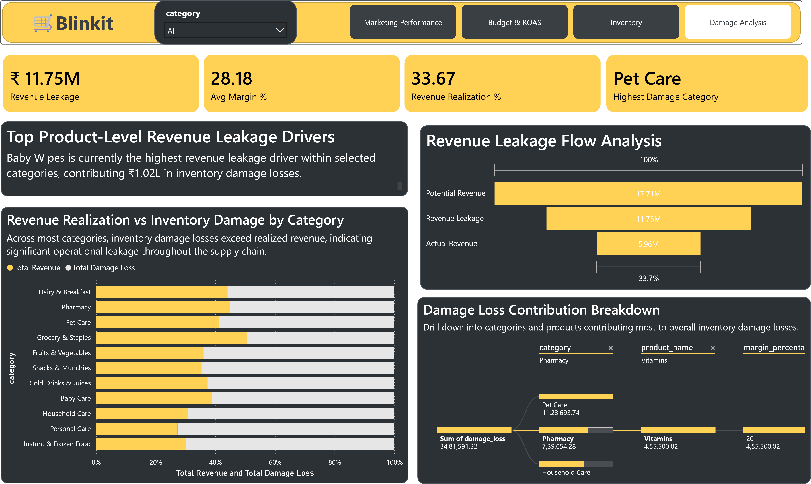

# 📊 Blinkit End-to-End Business Performance Analysis

### A full-stack data analytics project — SQL · Excel · Power BI

**Built by:** Ch.Hinduja Reddy  
**Tools:** MySQL · Excel · Power BI · DAX  
**Dataset:** [Blinkit Retail Analytics — Kaggle](https://www.kaggle.com/datasets/akxiit/blinkit-sales-dataset)

---



---

## 🔍 What This Project Is About

Blinkit generates massive amounts of operational data — but raw numbers don't tell you where the business is bleeding money, which campaigns are wasting budget, or which products are dragging down profitability.

This project digs into those questions across two analytical lenses:

- **Marketing:** Where is campaign spend actually converting, and where is it being wasted?
- **Inventory & Products:** Which categories and products are causing the most revenue leakage through damage?

Built as a 4-page interactive Power BI dashboard with dynamic subtitles, window function SQL queries, and DAX measures that respond to user filters in real time.

---

## ❓ Questions I Set Out to Answer

**Marketing:**
- Which campaigns actually drive subscriber conversions vs just impressions?
- Which channel delivers the best return per rupee spent?
- How much spend is being wasted on low-converting campaigns?
- Does ROAS vary meaningfully across audience segments?

**Inventory & Products:**
- Which product categories have the highest damage-related revenue leakage?
- Which specific products are the biggest loss drivers?
- How does margin efficiency compare against inventory risk across categories?
- How does the Revenue Realization compare to Inventory Damage by category 
---

## 🛠️ Project Workflow

```
Raw Kaggle Data → Excel Cleaning → MySQL Analysis → Power BI Dashboard
```

### 1. Excel Cleaning
- Standardized date formats across inventory table
- Converted order_id from scientific notation to preserve data integrity
- Validated product_id consistency across tables using VLOOKUP
- Documented all checks — including anomalies where damaged stock exceeded stock received

### 2. SQL Analysis
- Multi-table joins across inventory, products, and order tables
- CTEs for bleeding money product identification
- Window functions: RANK() OVER PARTITION BY for campaign and product rankings
- Rolling 3-month ROAS trend using ROWS BETWEEN window function
- Potential Revenue, Revenue lost and damage cost calculations

### 3. Power BI Dashboard
- analytical pages + cover page with navigation buttons
- Dynamic DAX subtitles that update based on slicer selections
- Decomposition tree for drill-down damage analysis
- Conditional formatting on risk monitoring matrix
- Multiple slicers affecting all visuals simultaneously

---

## 📐 Custom SQL & DAX

**ROAS(Return on Ad Spend)(SQL):**
```sql
ROUND(SUM(revenue_generated) / SUM(spend), 2) as ROAS
```

**Wasted Spend (DAX):**
```
Wasted Spend = SUMX(table, IF([conversion_rate] < 0.1, [spend], 0))
```

**Revenue Leakage (DAX):**
```
Revenue Leakage = [Potential Revenue] - [Actual Revenue]
```
**Funnel Value (DAX):**
```
Funnel Value = 
SWITCH(
    SELECTEDVALUE('Revenue Funnel'[Stage]),

    "Potential Revenue",
        SUM(product_economics[potential_revenue]),

    "Revenue Leakage",
        [Revenue Leakage],

    "Actual Revenue",
        SUM(product_economics[total_revenue])
)
```

**Conversion Rate (SQL):**
```sql
ROUND(SUM(conversions) * 100.0 / SUM(clicks), 2) as conversion_rate
```
**Joining blinkit_products & blinkit_inventory by Inner Join(SQL):**
```sql
INNER JOIN blinkit_products p ON i.product_id = p.product_id
```

---

## 💡 Key Findings

### Marketing
- **₹8.18M wasted** on campaigns with sub-10% conversion rates
- **App channel** drives highest conversion rate, **Email** delivers highest ROAS — suggesting different channels serve different business goals
- **Referral Program** is the #1 ROAS performer across all audience segments
- Revenue consistently **2x spend** across all months and audience segments
- Budget is equally distributed across channels — reallocation opportunity exists based on conversion efficiency

### Inventory & Products
- **Revenue realization is only 33.67%** — damage losses consume 66% of potential revenue
- **Pet Care** emerged as highest risk category — high margins but disproportionate inventory damage
- **₹34.81M in total damage losses** identified across all categories
- **Baby Wipes** is the single highest revenue leakage driver at ₹1.02M in damage costs
- Several high-margin categories show severe revenue leakage — strong pricing but poor operational efficiency

---

## 📁 Repository Structure

```
blinkit-analytics-project/
│
├── README.md
│
├── data/        # Raw and cleaned datasets                  
│   
├── excel-cleaning/                
│   └── cleaning_steps/
│
├── sql/                           
│   ├── marketing_analysis.sql
│   └── inventory_product_analysis.sql
│
├── powerbi/                       
│   ├── blinkit_analysis.pbix
│   └── dashboard_screenshots/
│       ├── Marketing_Performance/
│       ├── Marketing(Budget &ROAS)/
│       ├── Inventory/
|       └── Damage_Analysis/
│
├── insights/
│   └── findings.md                
│
└── assets/
    └── dashboard_preview.png
```

---

## 📸 Dashboard Pages

### Page 1 & 2 — Marketing Performance Analysis
Campaign conversion analysis, ROAS efficiency, wasted spend identification, channel performance heatmap, rolling ROAS trend, and campaign rankings — all filterable by audience segment and channel with dynamic subtitles.

### Page 3 & 4 —  Inventory Risk & Damage Analysis
Margin efficiency vs inventory risk scatter, revenue realization vs damage by category, decomposition tree for damage drill-down, revenue leakage funnel, and high-risk product monitoring matrix with conditional formatting.

---

*Built independently as a portfolio project. Open to feedback and collaboration.*
